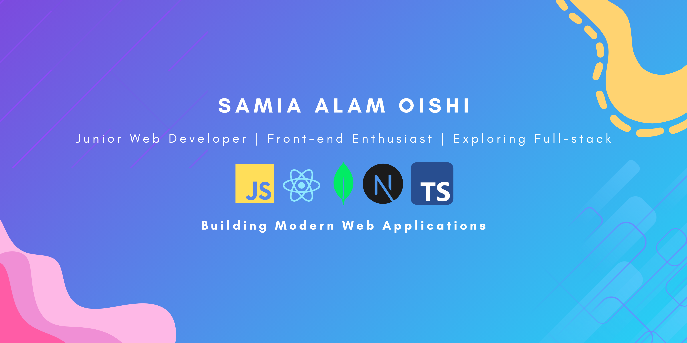

# Hi 👋 I'm Samia Alam Oishi

### Junior Web Developer (Front-end Focused)

  

  <strong>Building Modern Web Applications with Javascript, MERN stack & Next.js</strong>

---

## 📍 Contact Information

📍 Location: Dhaka, Bangladesh

📧 Email: scribe.oishi@gmail.com

💼 LinkedIn: (https://www.linkedin.com/in/samia-alam-oishi/)

🌐 Portfolio: (https://myportfolio-swart-alpha-83.vercel.app/)s

---

## 👩‍💻 About Me

I am a Computer Science & Engineering graduate with a strong interest in full-stack web development. I enjoy building responsive, user-friendly, and scalable web applications using modern JavaScript technologies.

My goal is to continuously improve my development skills and contribute to impactful software solutions while growing as a professional software engineer.

### 🔭 Current Activities

- 🌱 Exploring Next.js and TypeScript
- 💻 Building both frontend & full-stack applications
- 🚀 Improving React and backend development skills
- 📚 Learning scalable application architecture
- 🔨 Working on portfolio-quality projects
- ⚡ Practicing problem-solving and software development concepts

---

## 🚀 Skills & Technologies

  

### Frontend

- HTML5
- CSS3
- Tailwind CSS
- JavaScript (ES6+)
- React.js
- Next.js
- Typescript
- React Router
- DaisyUI
- Framer Motion
- Shadcn

### Backend

- Node.js
- Express.js
- SQL
- MongoDB
- Supabase
- JWT
- Firebase Authentication

### Version control & Deployment Tools

- Git
- GitHub
- VS Code
- Vercel
- Netlify
- Hostinger

---

## 📊 GitHub Statistics

  

---

⭐ Thank you for visiting my profile!

